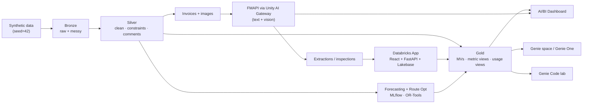

# PIL Data + AI Workshop on Databricks 🚢

A complete, self-contained, hands-on workshop that provisions **every asset** for
a full-day Databricks Data + AI workshop for **Pacific International Lines (PIL)**
— a global container liner. Clone into a Databricks workspace (Git Folders) and
run **one** setup notebook.

**Target environment:** Azure Databricks · `southeastasia` · serverless. Every
region-sensitive choice degrades gracefully and tells the facilitator exactly
what an account admin must enable.

---

## What you get

**Part 1 — Analytics & Genie**
- ~24 months of realistic synthetic shipping data in a **medallion** architecture
  (Bronze → Silver → Gold) with materialized views + **metric views**.
- A polished **4-page AI/BI dashboard** (Fleet Ops · Commercial · Sustainability
  · AI Usage & Governance).
- A **Genie space** (Genie Agent) over the gold layer with instructions, sample
  questions, and verified benchmarks, explorable through **Genie One**.
- A **Genie Code** build-your-own-dashboard lab (an agent **skill** + a
  copy-paste **prompt ladder**).

**Part 2 — Agentic Apps & ML**
- **Agent Bricks** invoice extraction + **container image vision**, on
  Foundation Model APIs governed by **Unity AI Gateway** (all traffic visible on
  dashboard Page 4).
- A production-quality **Databricks App** (React + Vite + FastAPI) with a
  **Lakebase** review queue closing the analytics → ops → analytics loop.
- Classic **ML**: spare-parts / demand **forecasting** (LightGBM + Croston/TSB)
  and **route optimization** (OR-Tools min-cost flow + VRPTW).

---

## Architecture

See [`docs/architecture.md`](docs/architecture.md) for full diagrams, the ML
brainstorm, and design assumptions.

---

## Quickstart (5 steps)

1. **Clone** this repo into Databricks: *Workspace → Repos → Add Repo* (or Git
   Folders), pointing at your fork.
2. **Open** `setup/00_setup_all.py`.
3. **Run all** — after the preflight checks it creates a **daily Databricks Job**
   (one task per notebook 01–12, serverless, scheduled) and triggers a run; watch
   it under **Workflows**. It prints the Job URL and every created asset. (Prefer
   an in-session run? Set the `orchestration` widget to `inline`. Choose
   `scale=demo` for a fast first run.)
4. **Explore Part 1**: open the **PIL Operations** dashboard and the **Genie**
   space; try the Genie Code lab in [`genie_code/`](genie_code/).
5. **Deploy Part 2**: build the app frontend (`cd app/frontend && npm install &&
   npm run build`), then run `setup/10_deploy_app.py` and open the app.

> Prerequisites an Azure **account admin** may need to enable ahead of time:
> Foundation Model APIs (+ cross-geography routing), the Mosaic/Unity AI Gateway
> preview, partner-powered AI for Genie Code, serverless, and Lakebase. The
> preflight cell in `00_setup_all` reports the status of each.

To remove everything: run `setup/99_teardown.py` (set the `confirm` widget).

---

## Repository layout

| Path | What |
|---|---|
| `setup/` | Numbered setup notebooks (`00_setup_all` orchestrates 01–12; `99_teardown`). |
| `src/pil_workshop/` | Shared library: `config`, `llm` (FMAPI single source of truth), `dbx_api`, data generators, silver/gold builders, `ml/`. |
| `assets/` | Dashboard JSON, Genie config, metric-view YAML. |
| `genie_code/` | Genie Code agent skill + prompt library. |
| `app/` | Databricks App — FastAPI backend + React/Vite frontend. |
| `docs/` | Facilitator guide, participant guide, architecture, troubleshooting. |

---

## Engineering standards

Unity Catalog everywhere · idempotent, serverless-first notebooks · deterministic
seeded data · **zero ungoverned model calls** (every LLM call resolves to a
workspace FMAPI endpoint via `pil_workshop.llm`) · no secrets or hardcoded hosts ·
Ruff-clean Python · ESLint/Prettier-clean TypeScript · MIT licensed.

## License

[MIT](LICENSE).
