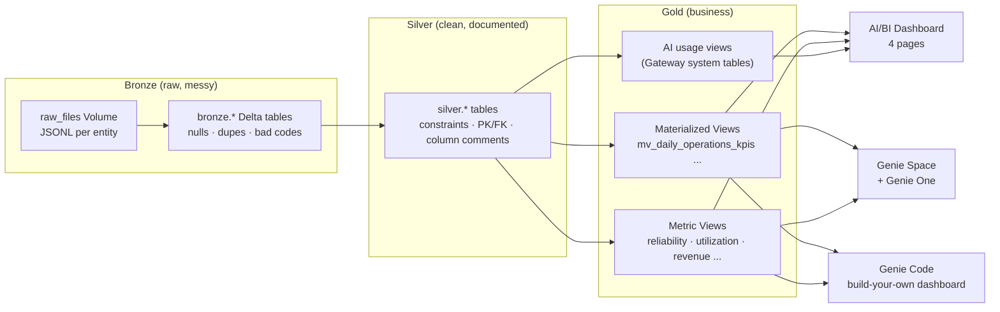
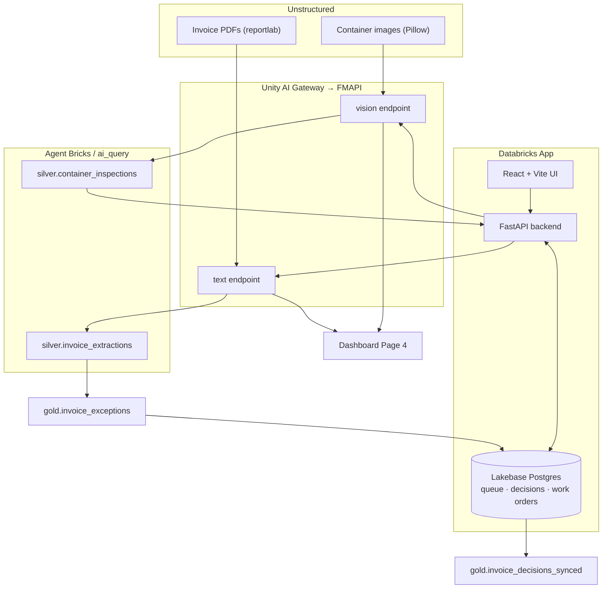

# PIL Workshop — Architecture & Design Notes

This document covers the end-to-end architecture for both parts of the workshop,
the ML approach brainstorm (Section 9 of the master prompt), and the assumptions
made where the prompt left choices open.

---

## Assumptions & environment

- **Cloud / region:** Azure Databricks, `southeastasia`. Every region-sensitive
  choice (FMAPI model availability, Genie Code geo, Lakebase, serverless) assumes
  this. Where a capability needs an account-console toggle, setup detects it,
  degrades gracefully, and prints what an admin must enable.
- **Catalog / schemas:** `pil_workshop` with `bronze`, `silver`, `gold`, `apps`,
  `ml`. Overridable via the `catalog` widget on every notebook.
- **Scale:** a `demo` preset (fast, full setup in minutes on serverless) and a
  `full` preset matching the master-prompt volumes. Default `demo`.
- **Determinism:** every generator is seeded (`seed=42`); re-runs are identical.
- **Governed AI:** all model calls route through Databricks FMAPI governed by
  Unity AI Gateway; endpoint names live only in `src/pil_workshop/llm.py`.
- **KPIs by construction:** operational KPIs are engineered into plausible
  industry bands (see `config.KPI_RANGES`) so the live smoke tests pass.

---

## Part 1 — Analytics & Genie

Data generators (`src/pil_workshop/datagen`) produce a coherent liner business:
vessels, ports (real UN/LOCODEs), routes (real rotations), voyages + legs,
containers (valid ISO 6346 check digits), bookings/shipments, container events,
port calls, invoices, and spare-parts consumption. Silver cleans the injected
messiness; Gold exposes materialized + metric views tuned to PIL's KPIs.

---

## Part 2 — Agentic Apps & ML

The app closes the loop: analytical exceptions → Lakebase review queue → human
decision → back to the gold layer (`invoice_decisions_synced`). All model traffic
(notebooks **and** app) hits the same governed endpoints and appears on Page 4.

---

## ML brainstorm (Section 9)

### Inventory / spare-parts & container-demand forecasting

A shipping line forecasts two very different things, and the method should match
the demand signature:

| Tier | Method | When it wins |
|---|---|---|
| Baseline | **Seasonal-naive** | Strong weekly/annual seasonality, cheap sanity check. |
| Statistical | **ETS / ARIMA / SARIMAX** | Smooth, high-volume series (e.g. total TEU on a lane). |
| Statistical (intermittent) | **Croston / TSB** | **Spare parts** — many zero-demand days; Croston separates demand size from interval, TSB updates demand probability every period (better for obsolescence). |
| ML | **LightGBM / XGBoost** (global) | Many related series with shared drivers; lag + calendar + port-congestion features; one global model generalizes and is cheap to serve. |
| Deep / foundation | **TimesFM / Chronos** (via serving) | Long horizons, cold-start SKUs, or when you want zero-shot forecasts without per-series training. |

**Recommendation for PIL:**
- **Container demand:** a **global LightGBM** model with **hierarchical
  reconciliation** (SKU → depot → network) so totals are consistent.
- **Spare parts:** **Croston/TSB** as the default because intermittency breaks
  MAPE-style errors and smooth models.
- **Evaluate** with **WAPE** (robust to zeros) and **MASE** (scale-free, compares
  to seasonal-naive) on a **rolling backtest** — implemented in notebook 11.

Why not just deep learning everywhere? For thousands of intermittent spare-parts
series the data per series is tiny; a global GBM with good features usually beats
a heavy model on both accuracy and cost, and Croston is a strong, explainable
baseline the business trusts.

### Route optimization

Two real, distinct problems:

1. **Port rotation / speed optimization** — fuel burn grows roughly with the
   **cube of speed**, trading off against schedule reliability. This is a
   **nonlinear program** (or a discretized **DP over speed choices** per leg).
   The lever: slow-steaming saves fuel/CO₂ but risks missing the pro-forma ETA.
2. **Empty-container repositioning** — a classic **min-cost flow / linear
   program** across ports given surplus/deficit imbalance and per-lane costs.
   Solved in notebook 12 with OR-Tools; we also report savings vs. a naive
   single-hub plan.
3. **Last-mile / drayage** — **VRPTW** (vehicle routing with time windows) around
   a port hub, solved with **OR-Tools CP-SAT** routing.

**Recommendation for PIL:** use **OR-Tools** for the workshop — zero license
friction, strong min-cost-flow and routing solvers, and a clean Python API. For
speed optimization, start with a discretized DP (a handful of speed bands per
leg) before reaching for a full NLP solver.

---

## Idempotency & teardown

Every notebook uses `CREATE ... IF NOT EXISTS` / `CREATE OR REPLACE`, so
re-running `00_setup_all` is a no-op-safe operation. `99_teardown` removes all
assets (catalog, dashboard, Genie space, app, Lakebase instance) with confirm
guards. See `docs/troubleshooting.md` for recovery playbooks.
